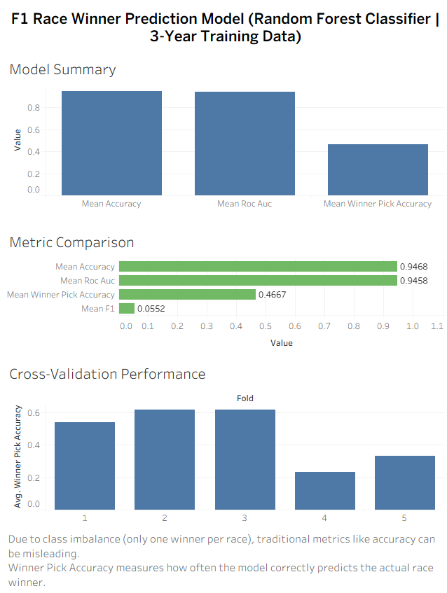

# F1 Race Winner Prediction

A machine learning pipeline that predicts Formula 1 race winners using pre-race data (free practice, qualifying) collected via the [FastF1](https://docs.fastf1.dev/) API.

## How It Works

The project follows a multi-stage pipeline:

1. **Collect** — Fetch raw session data (laps, weather, results, track status) from the FastF1 API
2. **Organize** — Merge raw CSVs per session into structured DataFrames
3. **Normalize** — Clean data, convert times to seconds, derive session-relative metrics (delta to pole, delta to best lap, etc.)
4. **Feature Engineering** — Prefix features by session type (e.g. `fp1_lap_mean`, `quali_delta_to_pole`) and merge all sessions into a single training DataFrame keyed on `(event_id, driver_id)`
5. **Evaluate** — GroupKFold cross-validation ensuring whole races stay together, with a custom "winner pick accuracy" metric
6. **Predict** — Train a final model and predict the winner for an upcoming race

## Project Structure

```
F1_Prediction/
├── main.py                          # End-to-end pipeline runner
├── requirements.txt
├── data/
│   ├── raw/                         # FastF1 data fetching
│   │   └── raw_data_collector.py
│   └── interim/                     # Data organization and aggregation
│       ├── data_organizer.py
│       ├── aggregators/             # Laps, weather, track status aggregation
│       └── utils/                   # Column standardization, session name mapping
├── f1_prediction_ml/
│   ├── colors.py                    # Shared console color constants
│   ├── ml_utils.py                  # Common utilities (session lists, row IDs, column ops)
│   ├── normalize/                   # Per-session-type normalizers
│   │   ├── normalize_free_practice.py
│   │   ├── normalize_quali.py
│   │   └── normalize_race.py
│   ├── features/                    # Per-session-type feature builders
│   │   ├── features_free_practice.py
│   │   ├── features_quali.py
│   │   ├── features_race.py
│   │   ├── features_utils.py
│   │   └── concatenate_csvs.py
│   ├── pipelines/                   # Orchestration scripts
│   │   ├── collect_raw_data_pipeline.py
│   │   ├── raw_data_processor.py
│   │   ├── normalizer.py
│   │   └── features_engineering.py
│   ├── evaluation/
│   │   └── model_evaluation.py      # GroupKFold CV with winner-pick metric
│   └── modeling/
│       ├── train_post_quali.py      # Train and save a RandomForest model
│       ├── build_next_race_features.py  # Validate and align inference features
│       └── predict_winner.py        # Load model and predict race winners
└── notebooks/
    ├── 01.eda.ipynb
    ├── 02.further_eda.ipynb
    └── 03.model_selection.ipynb
```

## Setup

```bash
python -m venv .venv
source .venv/bin/activate
pip install -r requirements.txt
```

## Usage

### Run the full pipeline

```bash
python main.py
```

This fetches data, processes it through all stages, trains models (RandomForest, GradientBoosting), evaluates them with cross-validation, and prints a pole-sitter baseline for comparison.

### Predict the next race winner

```bash
python -m f1_prediction_ml.modeling.predict_winner
```

Requires a trained model artifact at `models/random_forest_winner.pkl` and a feature CSV at `data/processed/next_race_features.csv`.

## Data

Raw data is sourced from the [FastF1](https://docs.fastf1.dev/) Python library, which wraps the official F1 timing API. Session types include:

| Code | Session Type       |
|------|--------------------|
| FP1  | Free Practice 1    |
| FP2  | Free Practice 2    |
| FP3  | Free Practice 3    |
| Q    | Qualifying         |
| SQ   | Sprint Qualifying  |
| SS   | Sprint Shootout    |
| S    | Sprint Race        |
| R    | Race               |

CSV files are excluded from version control (`.gitignore`). Re-run the collection pipeline to regenerate them.

## Models

The evaluation module (`model_evaluation.py`) uses **GroupKFold** cross-validation so that all drivers from a given race stay in the same fold. Metrics reported:

- Accuracy, F1, ROC AUC, Log Loss (standard classification)
- **Winner Pick Accuracy** — for each race in the test fold, the driver with the highest predicted win probability is selected; this metric measures how often that driver was the actual winner

## 📊 Model Performance & Insights

The model was evaluated using GroupKFold cross-validation to ensure that entire races are kept together during training and testing.

### Key Results (Random Forest)

- Accuracy: **0.947**
- ROC AUC: **0.946**
- Winner Pick Accuracy: **0.467**
- F1 Score: **0.055**

### Important Insight

This is a highly imbalanced classification problem — only one driver wins each race.

Because of this:
- Traditional metrics like **accuracy can be misleading**
- The most meaningful metric is **Winner Pick Accuracy**, which measures how often the model correctly predicts the actual race winner

---

### 📈 Tableau Dashboard

The dashboard below visualizes:

- Overall model performance metrics
- Comparison of evaluation metrics
- Cross-validation consistency across folds

🔗 **Interactive Dashboard:** [View on Tableau Public](https://public.tableau.com/app/profile/attila.bordan3474/viz/F1_Prediction_Model_3_years_data/Dashboard1?publish=yes)


